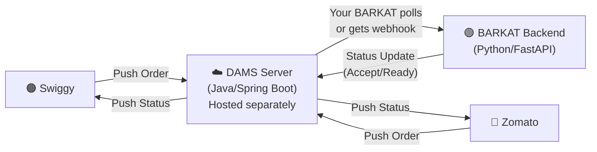

# Dyno APIs DAMS — Complete Breakdown

## What is DAMS?

**DAMS = Dyno APIs Management Server** — It's a **Java Spring Boot webhook server** that acts as **middleware between Swiggy/Zomato and your POS system (BARKAT)**.

Think of it like this:

> **Key Insight:** DAMS is NOT part of your BARKAT codebase. It's a **separate Java server** that Dyno APIs provides/hosts. It sits between the food delivery platforms and your POS. Swiggy/Zomato talk to DAMS, and BARKAT talks to DAMS.

---

## How DAMS Works — The Flow

### 📥 Incoming Orders (Swiggy/Zomato → DAMS → BARKAT)

1. Customer places order on Swiggy/Zomato
2. Platform pushes order data to **DAMS webhook server** (`POST /api/v1/orders`)
3. DAMS stores it in its PostgreSQL DB (table: `tbl_orders`) with fields:
   - `order_id` — Swiggy/Zomato order ID
   - `vendor` — "swiggy" or "zomato"
   - `res_id` — Your restaurant's ID on that platform
   - `order_json` — Full raw order payload (TEXT blob)
   - `status` — Order status string
   - `status_code` — Numeric status (0=new, 1=accepted, 2=ready, 3=dispatched)
   - `is_processed` — Boolean flag for polling
4. **BARKAT polls DAMS** to fetch new orders: `GET /api/v1/{restaurantId}/orders`
5. Orders appear in your Aggregator Hub / KDS

### 📤 Status Updates (BARKAT → DAMS → Swiggy/Zomato)

1. Staff marks order "Accepted" or "Ready" in BARKAT
2. BARKAT calls DAMS: `POST /api/v1/orders/{orderId}/status` with `statusCode` (1=accept, 2=ready, 3=dispatch)
3. DAMS stores the status update and forwards it to Swiggy/Zomato

### 📋 Menu/Item Availability Sync

1. Owner marks an item "Out of Stock" in BARKAT
2. BARKAT calls DAMS: `POST /api/v1/{restaurant_id}/items/status` with `entityId`, `stockStatus`, `aggregator`
3. DAMS stores it and forwards the toggle to Swiggy/Zomato
4. Item goes "Out of Stock" on both platforms automatically

---

## DAMS API Endpoints Reference

| Method | Endpoint | Purpose |
|--------|----------|---------|
| `GET` | `/status` | Health check |
| `POST` | `/api/v1/orders` | Receive orders from aggregators (webhook) |
| `GET` | `/api/v1/{resId}/orders` | Fetch orders for a restaurant (BARKAT polls this) |
| `GET` | `/api/v1/orders` | Fetch all orders (admin, with pagination) |
| `GET` | `/api/v1/{resId}/orders/status` | Get pending status actions for a restaurant |
| `POST` | `/api/v1/orders/{orderId}/status` | Push status update (accept/ready/dispatch) |
| `POST` | `/api/v1/{resId}/orders/history` | Insert order history status |
| `GET` | `/api/v1/{resId}/items` | Get item/category stock changes to process |
| `POST` | `/api/v1/{resId}/items` | Save aggregator items status |
| `POST` | `/api/v1/{resId}/items/status` | Toggle item stock on/off |
| `POST` | `/api/v1/{resId}/categories/status` | Toggle category stock on/off |
| `POST` | `/api/v1/errors` | Log errors |

---

## DAMS Database Tables

| Table | Purpose |
|-------|---------|
| `tbl_orders` | Stores all incoming orders from Swiggy/Zomato |
| `tbl_orders_history` | Stores order history sync status per restaurant |
| `tbl_items` | Stores item/category stock toggle requests |
| `tbl_items_status` | Stores bulk item sync status per restaurant |

---

## What Needs To Happen for BARKAT Integration

Since you're using **Dyno APIs DAMS** (not UrbanPiper), the integration approach is different from my previous plan. Here's what we actually need:

### On the BARKAT side, we need to build:

1. **DAMS Polling Service** — A background service that polls the DAMS server periodically to fetch new Swiggy/Zomato orders and insert them into your `aggregator_orders` table

2. **DAMS Status Push** — When staff marks an order as Accepted/Ready in BARKAT, push the status update to DAMS via `POST /api/v1/orders/{orderId}/status`

3. **DAMS Item Sync** — When owner toggles item availability in BARKAT, push the toggle to DAMS via `POST /api/v1/{resId}/items/status`

4. **Settings Configuration** — Store the DAMS server URL, restaurant ID (Swiggy/Zomato res IDs) in BARKAT settings

5. **Frontend Updates** — Wire up the Aggregator Orders tab and Settings to use real DAMS data

---

## Questions Before We Proceed

> [!IMPORTANT]
> Before I write any code, I need to understand a few things:

1. **Is the DAMS server already deployed and running?** If yes, what's the URL? (e.g., `https://dams.dynoapis.com` or a custom server)

2. **Do you already have your Swiggy/Zomato restaurant IDs registered with Dyno APIs?** The `resId` that DAMS uses to identify your restaurant.

3. **Polling vs Webhook:** Currently DAMS works on a **polling model** (BARKAT asks DAMS for new orders). Do you want:
   - **Option A:** BARKAT polls DAMS every few seconds (simpler, what DAMS is designed for)
   - **Option B:** We also set up DAMS to push webhooks to BARKAT (more real-time but needs DAMS to be configured to call your backend)

4. **Is the DAMS server self-hosted by you, or hosted by Dyno APIs team?** This matters for configuration.

5. **Any authentication required?** The DAMS code I see has no API key/auth — it's open. Is there any auth layer (like an API key header) that's been added on top?
